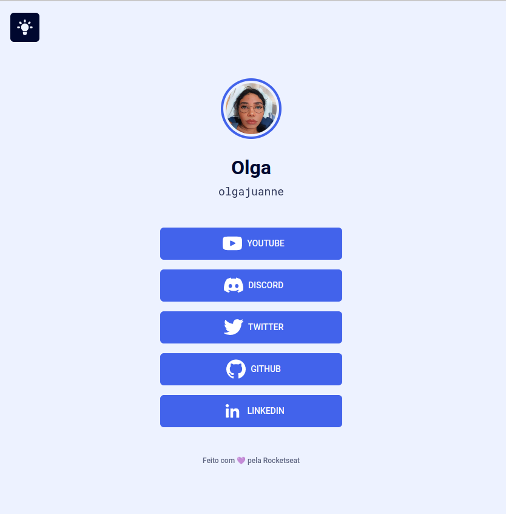
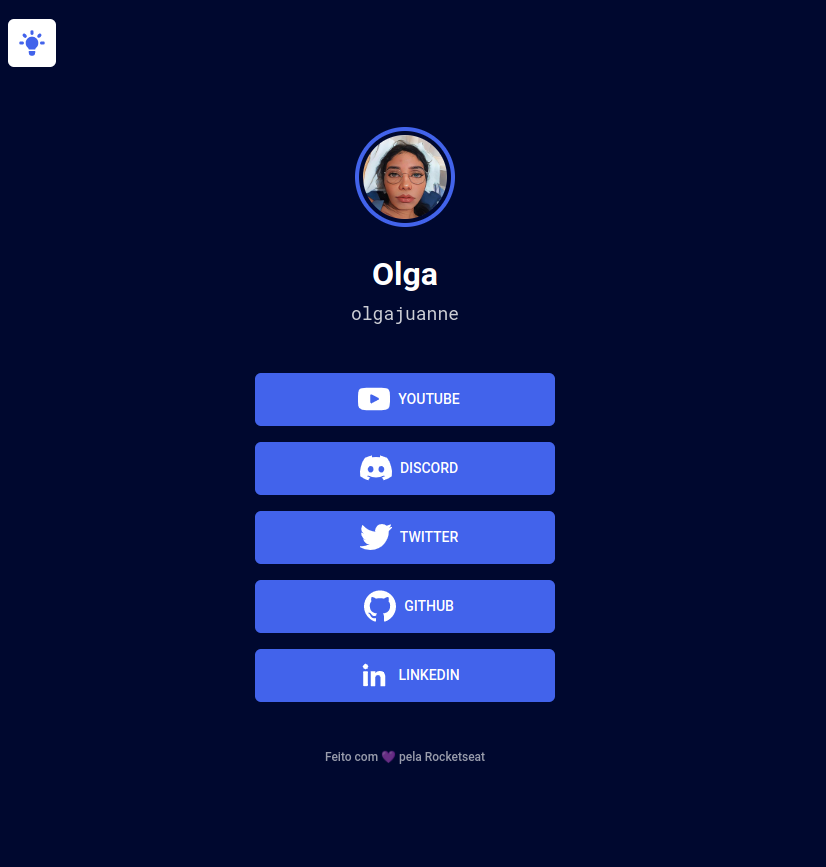

# Maratona-Explorer-2

Evento gratuito realizado pela **@Rocketseat** dos dias 03 a 06 de julho.

## 🚀 Tecnologias

- HTML
- CSS
- Javascript
- <a href="https://code.visualstudio.com/"> Visual Studio Code </a>
- <a href="https://www.figma.com/"> Figma </a>

## 💻 Projeto

RocketLinks uma plataforma de social link.  
[🔗 Clique aqui para acessar](https://olgajuanne.github.io/Maratona-Explorer-2/)
### 🎚 Modificações

- Botão para mudar para modo dark com javascript.
- Função que pega dados das sociais medias e github, com javascript.

## :memo: Licença

Esse projeto está sob a licença MIT license.

---

> *A NLW é um evento de conteúdos gratuitos voltados para programação, promovido pela **@Rocketseat**.*

